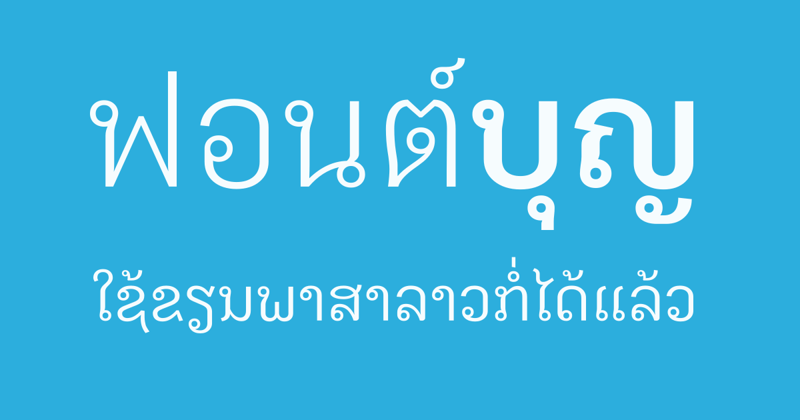

{: .banner}

**บุญ** คือ ชุดตัวอักษรตระกูลหนึ่ง (font family) ที่มุ่งแสดงผลการจัดเรียงตัวอักษรไทยให้ถูกต้องในเว็บบราวเซอร์ ตัวอักษรทุกตัวทั้งไทย, ละติน และลาว นั้นวาดขึ้นจากรูปทรงเลขาคณิตเพื่อความเรียบง่าย โดยตั้งใจให้สามารถใช้งานได้ดีทั้งส่วนที่เป็นยูเซอร์อินเตอร์เฟสและส่วนที่เป็นเนื้อความ<!--more-->

-----

[๏ ดาวน์โหลดบุญ ๛](https://github.com/fontuni/boon/releases)
{: #download .boon-600}

-----

### การใช้งาน
{: .section-title }

- ฟอนต์บุญเวอร์ชั่นล่าสุดมีทั้งหมด 5 น้ำหนัก (300-700) และ 2 สไตล์ (ตัวตรงกับตัวเอน) รวมเป็นฟอนต์ในตระกูลทั้งหมด 10 ตัว
- **ฟอนต์บุญตั้งแต่เวอร์ชั่น 2.0 ขึ้นไปจะแสดงผลได้ถูกต้องเฉพาะในโปรแกรมที่รองรับ OpenType ได้ดี** หากคุณพบปัญหาวรรณยุกต์ไทยและลาวลอย โปรดเช็คก่อนว่าโปรแกรมที่คุณใช้รองรับ OpenType features กับภาษาไทยและลาวหรือไม่ (สำหรับโปรแกรมของ Adobe ต้องเปิดใช้ World-Ready หรือใช้ text composer แบบ Middle East) ส่วนในระบบปฏิบัติการสมัยใหม่ไม่น่ามีปัญหา ผมทดสอบใน GNU/Linux, Mac OSX และ Windows 10
- หากต้องการใช้งานฟอนต์บุญในขนาดเล็กกับจอแสดงผลความละเอียดต่ำ แนะนำให้ติดตั้งไฟล์ TTF ครับ โดยเฉพาะใน Windows เพราะจะคมชัดกว่าเมื่อเปิดใช้ ClearType
- หากต้องการใช้งานในขนาดใหญ่กับโปรแกรมกราฟิคหรืองานสิ่งพิมพ์ แนะนำให้ติดตั้งไฟล์ OTF เพราะเส้นโค้งจะเรียบเนียนกว่า TTF มาก
- สำหรับจอความละเอียดสูง เช่น สมาร์ทโฟน แทบเล็ต หรือแลปท็อปคุณภาพสูง จะเลือกติดตั้ง TTF หรือ OTF ก็ได้
- ส่วนการใช้งานเป็น webfont แนะนำให้ใช้ TTF favour (woff2-ttf, woff-ttf & eot-ttf) เพราะจะอ่านง่ายกว่าในขนาดเล็กกับจอแสดงผลทุกแบบ แต่ถ้าต้องการไฟล์ขนาดเล็กเพื่อให้หน้าเว็บโหลดเร็วขึ้น ก็เลือก OTF favour (woff2-otf, woff-otf & eot-otf)
- ตัวอย่าง CSS สำหรับการใช้ `@font-face` ดูได้ในไฟล์ [`boon-all.css`](css/boon-all.css) หรือ SCSS [`boon-all.scss`](css/boon-all.scss)

-----

### ภาษาที่รองรับ
{: .section-title }

นอกจากตัวอักษรไทยและลาวแล้ว ฟอนต์บุญตั้งแต่เวอร์ชั่น 1.0 ขึ้นไปยังมีตัวอักษรละตินครอบคลุมมากกว่า [Adobe Latin-4](https://adobe-type-tools.github.io/adobe-latin-charsets/adobe-latin-4.html) หมายความว่าครอบคลุมเกือบทุกภาษาในยุโรป อเมริกา รวมถึงภาษาเวียดนามด้วย [ดูหน้าทดสอบภาษา](languages.html)

-----

### ทดสอบการแสดงผล
{: .section-title }

- [หน้าทดสอบ OpenType features](features.html) เป็นสไลด์โชว์ที่เปลี่ยนน้ำหนักและสไตล์ของฟอนต์ได้ตรงมุมบนด้านขวาสุดในหน้านั้น
- [หน้าทดสอบ Hinting](hinting.html) เพื่อตรวจเช็คความสม่ำเสมอและความคมชัดของตัวอักษรหลายขนาด

-----

### ความเปลี่ยนแปลงในแต่ละเวอร์ชั่น
{: .section-title }

คุณสามารถอ่านได้จาก [FONTLOG](FONTLOG.html)

-----

### สัญญาอนุญาต
{: .section-title }

&copy; ๒๕๕๖-๒๕๕๙ [สังศิต ไสววรรณ](https://sungsit.com/)

**ฟอนต์บุญ** ใช้สัญญาอนุญาต (license) แบบ [SIL Open Font License v1.1](http://scripts.sil.org/OFL) แปลว่าคุณมีอิสระเต็มที่ในการใช้งาน ดัดแปลง หรือปรับปรุง เงื่อนไขคือเมื่อดัดแปลงจากต้นแบบแล้วอยากจะเผยแพร่ผลงานใหม่ก็ต้องใช้สัญญาอนุญาตแบบเดียวกันและต้องเปิดเผยซอร์สโค้ดเช่นกัน

-----

### แจ้งปัญหาการใช้งาน
{: .section-title }

หากคุณพบปัญหาในการใช้งานฟอนต์บุญก็สามารถแจ้งกันเข้ามาได้ที่ <https://github.com/fontuni/boon/issues> หรือ [FontUni Fanpage](https://facebook.com/FontUni) หรือพูดคุยอย่างกันเป็นเองที่ [ชุมชนสาวก f0nt](http://www.f0nt.com/forum/index.php/topic,22976.0.html) **ขอขอบคุณ พี่น้องทุกท่านที่ให้ความเห็นและช่วยทดสอบฟอนต์บุญไว้ ณ ที่นี่ด้วยครับ**

